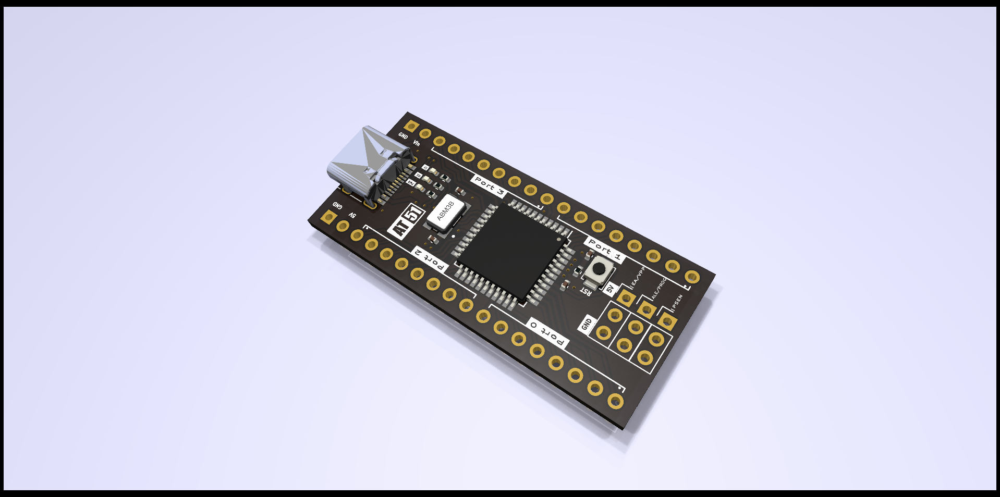
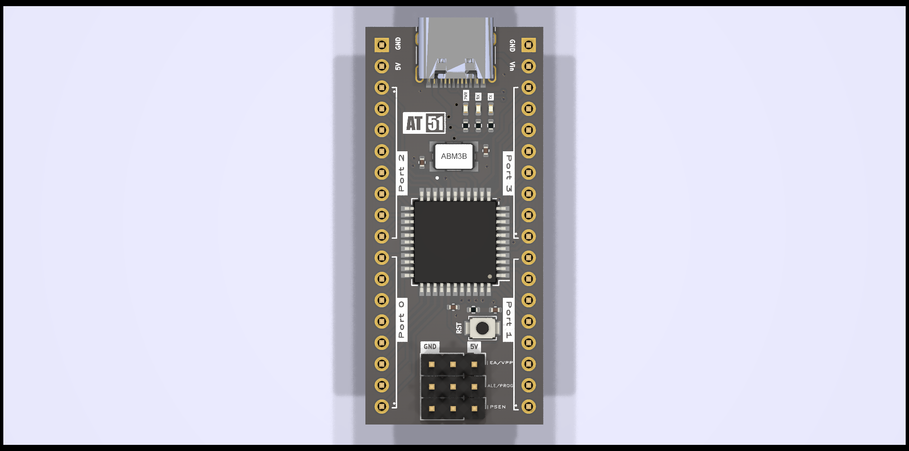
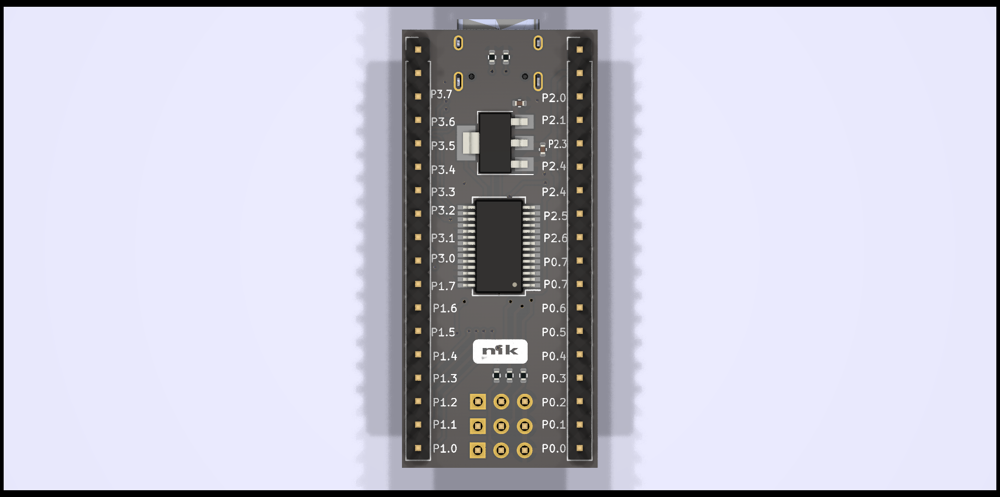
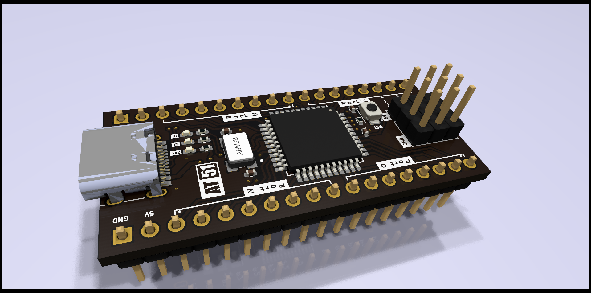
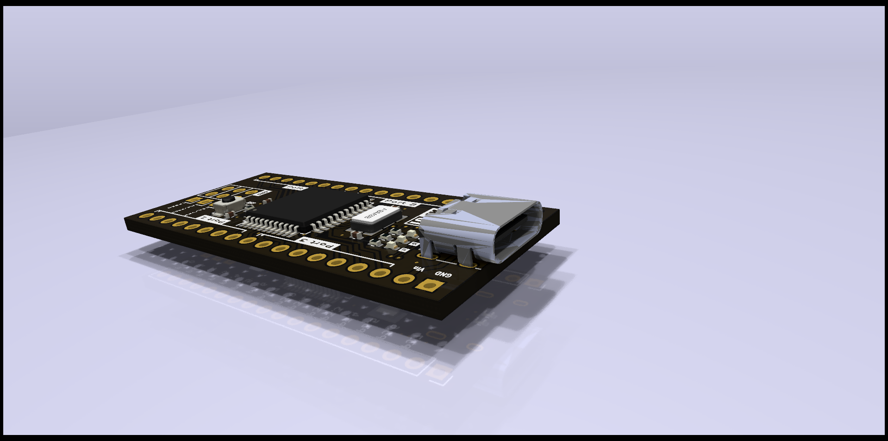
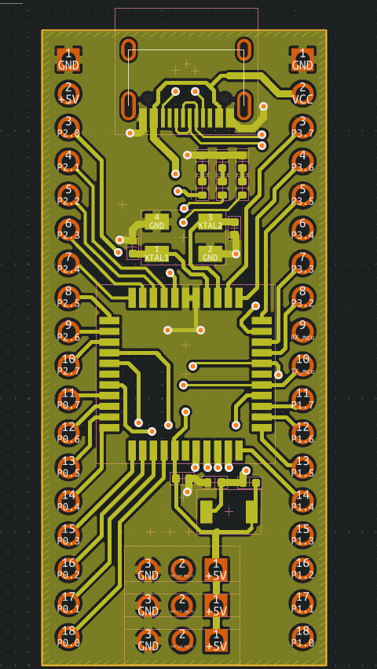
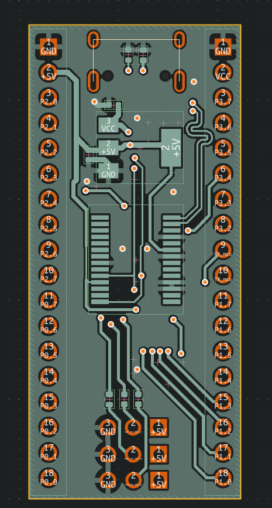

# AT51

Arduino Nano-style development board for the AT89S51 (8051-compatible) microcontroller.

AT51 is an open-source development board designed to bring the classic 8051 architecture into a modern, breadboard-friendly form factor. The project was created to showcase PCB design skills while providing a compact development platform for learning and experimenting with 8051-based microcontrollers.

<p align="center">
  
</p>

---

## Features

- Arduino Nano-inspired footprint
- Based on the AT89S51 microcontroller
- USB connectivity through FT232RL
- On-board programming interface
- Port-wise GPIO breakout
- Power status LED
- UART TX/RX activity LEDs
- Compact and breadboard-friendly layout

---

## Hardware Specifications

| Parameter | Value |
|------------|---------|
| MCU | AT89S51 |
| Architecture | 8051 Compatible |
| Operating Voltage | 5V |
| Clock Frequency | 11.0592 MHz |
| USB Interface | FT232RL |
| Form Factor | Arduino Nano Style |

---

## Design Goals

The objective of this project was to:

- Create a compact 8051 development platform
- Modernize the development experience for legacy microcontrollers
- Demonstrate PCB design and hardware integration skills
- Provide an open-source reference design for students and hobbyists

---

## Repository Contents

```text
/
├── Project File/
│   ├── Schematic Files
│   ├── PCB Layout
│
├── Gerbers/
│   └── Manufacturing Files
│
├── Images/
│
└── README.md
```

---

## Images

### PCB Render

  |||
  |--|--|
  |||


### Layout

|||
|--|--|

---

## Manufacturing Status

> ⚠️ Design Complete — Not Yet Manufactured

This repository currently contains the completed design files and manufacturing outputs. Physical prototypes have not yet been fabricated or tested.

---

## License

This project is released under the MIT License.

See the `LICENSE` file for details.

---

## Author

Designed by **Nikhil Motagi**.

If you find this project useful, feel free to star the repository and share your feedback.
